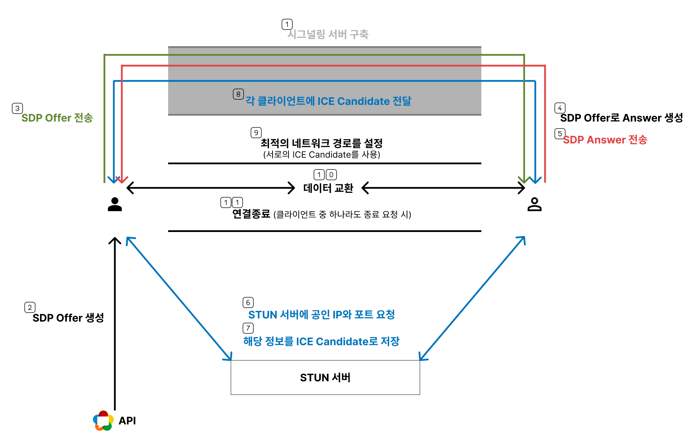

# WebRTC 연결과정

## WebRTC 연결 과정

#### Signaling 서버 설정 (1)

- Signaling 서버를 통해 두 클라이언트가 네트워크 정보와 연결 설정을 교환할 수 있도록 중개.

#### SDP Offer 생성 후 전달 (2 ~ 3)

- 클라이언트 A가 `RTCPeerConnection.createOffer()`를 호출하여 SDP Offer를 생성.
- Offer는 Signaling 서버를 통해 클라이언트 B에게 전달.
- Offer는 로컬 `RTCPeerConnection`에 설정된 후 Signaling 서버를 통해 클라이언트 B에게 전달.

#### SDP Offer 수신 및 Answer 생성 (4 ~ 5)

- 클라이언트 B는 SDP Offer를 Signaling 서버를 통해 수신.
- Offer 정보를 자신의 `RTCPeerConnection`에 설정한 후, SDP Answer를 생성.
- Answer는 로컬에 설정한 후 Signaling 서버를 통해 클라이언트 A에게 전달.

#### ICE Candidate 생성 및 교환 (6 ~ 8)

- 각 클라이언트는 로컬 네트워크와 공인 네트워크 정보를 기반으로 ICE Candidate를 생성.
- **STUN 서버 사용**
  - 각 클라이언트는 STUN 서버에 요청하여 자신의 공인 IP 및 포트 정보를 받음.
  - 그 후 이를 ICE Candidate로 설정.
- **Candidate 교환**
  - Signaling 서버를 통해 ICE Candidate 정보를 상대방에게 전달.
  - 클라이언트는 받은 ICE Candidate를 자신의 `RTCPeerConnection`에 추가.

#### ICE 연결 과정 (9)

- 각 피어는 교환된 ICE Candidate를 사용하여 최적의 네트워크 경로를 설정.
- 만약 NAT 방화벽으로 인해 직접 연결이 불가능 시, TURN 서버를 사용해 릴레이 연결을 설정.

#### P2P 연결 완료 및 데이터 전송 (10)

- ICE 연결이 완료되면 두 클라이언트 간의 직접적인 P2P 연결이 설정됨.
- 미디어 스트림(오디오, 비디오) 또는 데이터 스트림(텍스트 등)이 전송됨.

#### 연결 종료 (11)

- 한 클라이언트가 연결을 종료하면 `RTCPeerConnection.close()` 호출
- Signaling 서버에 종료 이벤트를 알리고, 다른 클라이언트도 이를 반영.
